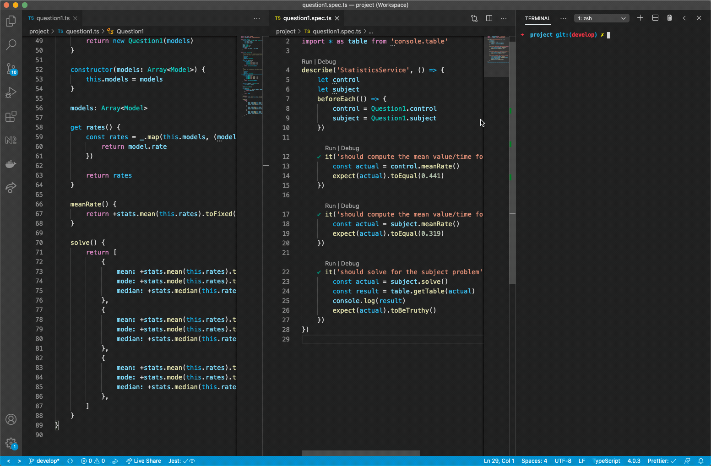
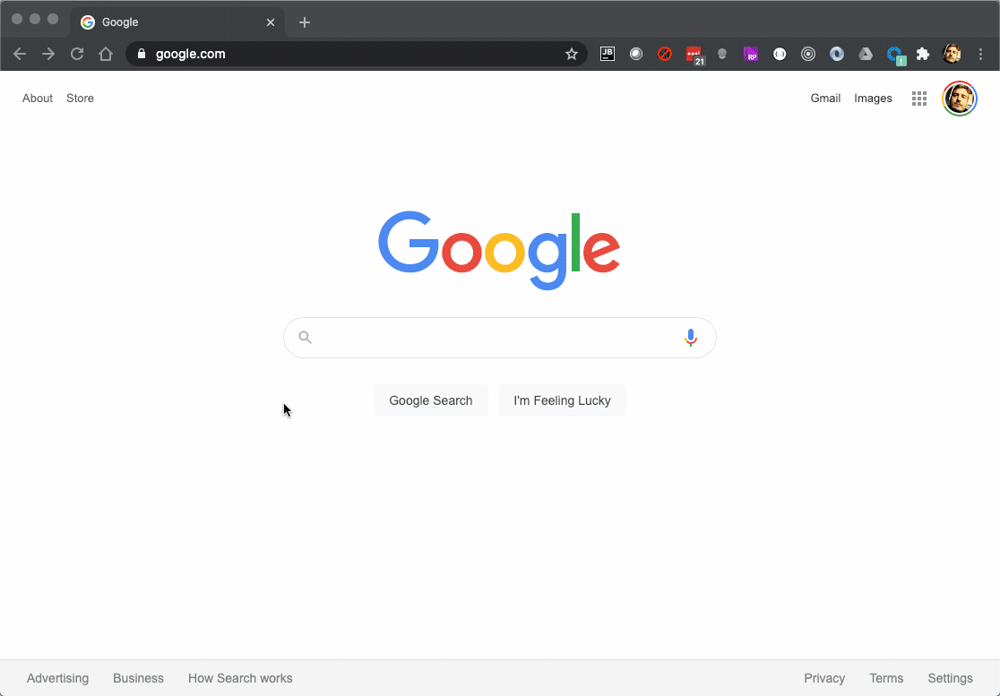

# meta-analytics-boilerplate
A boilerplate Typescript project for meta analytics research.

### Console Quick Start
1. Install [Node.js v12.x](https://nodejs.org/en/download/)
1. From inside the `console/` directory, execute `npm install`
1. Open the `Console.code-workspace` file with vscode.
1. Install [recommended vscode plugins](https://code.visualstudio.com/docs/editor/extension-gallery#_recommended-extensions)
1. Run the `question1.spec.ts` file as demonstrated below.

### Web Quick Start
1. Install [Node.js v12.x](https://nodejs.org/en/download/)
1. From inside the `web/` directory, execute `npm install`
1. From inside the `web/` directory, execute `npm run start`
1. Open the `Web.code-workspace` file with vscode.
1. Install [recommended vscode plugins](https://code.visualstudio.com/docs/editor/extension-gallery#_recommended-extensions)
1. In your browser visit `http://localhost:4200`.

