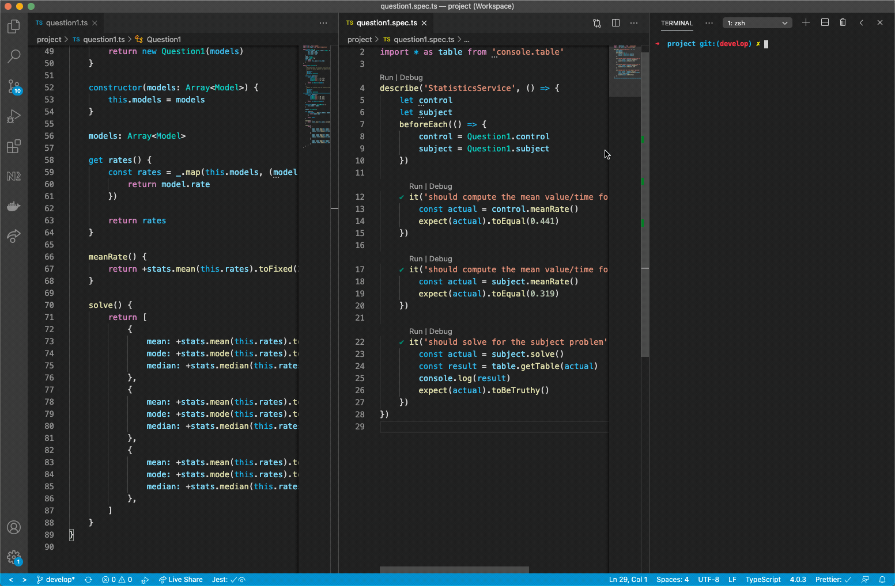

# meta-analytics-boilerplate
A boilerplate Typescript project for meta analytics research.

### Quick Start
1. Install [Node.js v12](https://nodejs.org/en/download/)
1. From inside the `project/` directory, execute `npm install`
1. Open the `project.code-workspace` file with vscode.
1. Install [recommended vscode plugins](https://code.visualstudio.com/docs/editor/extension-gallery#_recommended-extensions)
1. Run the `.spec.ts` file as demonstrated below.

